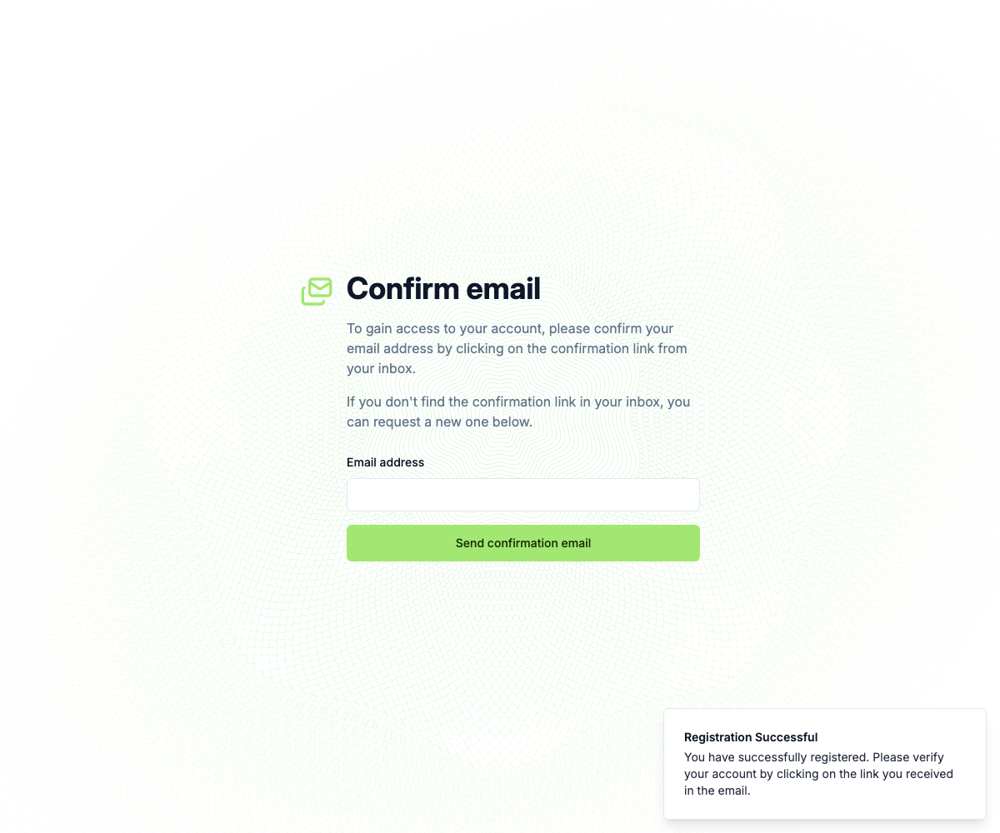

# Documenso on zeropg — swap Postgres for zeropg with no app patch

Proof that a **real, unmodified Prisma app** ([Documenso](https://github.com/documenso/documenso),
a DocuSign alternative) can run with its **full Postgres replaced by zeropg** —
changing only the Docker setup, never Documenso's source. Documenso uses the
**native Prisma query engine** (`new PrismaClient({ datasourceUrl })`, not a JS
driver adapter), and it talks to single-session PGlite over the real Postgres wire
just fine.



## What changed vs. Documenso's own self-hosting compose

Exactly two things — both in `docker-compose.yml`, zero source patches (compare to
`documenso/docker/production/compose.yml` at tag `v2.13.0`):

1. The `postgres:15` service → the **`zeropg-db`** service (PGlite on a Docker
   volume, exposed over the real Postgres wire via `@zeropg/client`'s `serveWire`
   + pglite-socket, with the `pgcrypto` + `pg_trgm` contrib extensions Documenso's
   migrations need).
2. The app's startup drops `prisma migrate deploy` (Prisma's native **schema**
   engine can't drive single-session PGlite) — `zeropg-db` applies Documenso's
   **real, untouched migrations** in-process on boot. Everything else is
   Documenso's stock `documenso/documenso:v2.13.0` image and stock server
   entrypoint (`node build/server/main.js` from `/app/apps/remix`, which is what
   stock `start.sh` runs after the migrate line).

Documenso's runtime is unchanged: its native Prisma **query** engine connects to
`zeropg-db` via `NEXT_PRIVATE_DATABASE_URL`. The only connection-string requirement
is `?sslmode=disable` (the Rust engine defaults to `prefer` and sends an SSLRequest
pglite-socket won't negotiate) and the `postgres` user.

## Run it

```sh
docker compose -p documenso-zeropg up -d --build   # zeropg-db applies 162 migrations, then Documenso boots against it
# open http://localhost:3102
```

Ports (unique to this example): app **3102**, zeropg-db **5462**.

Verify end-to-end in a browser (registers a user through Documenso's real UI,
including the required typed signature, then reads the rows back from zeropg):

```sh
node test/verify.mjs
```

## Verified result

- `zeropg-db` boot: **162/162 of Documenso's real migrations applied, 52 public
  tables** (`pgcrypto` + `pg_trgm` loaded).
- Documenso boots, runs its own startup DB writes over the wire (service-account
  email migration), starts its in-process cron poller, serves real pages
  (`/signup` 200, `/api/health` 200), **no 5xx**.
- Registering through the real signup UI (name + email + password + typed
  signature) wrote a full object graph to zeropg via the **native** Prisma engine
  over the wire:

  ```
  User=1 (id, name "Zeropg Demo", email, emailVerified=null, createdAt)
  Organisation=1 (Personal Organisation, type PERSONAL)  ← created by onCreateUserHook
  OrganisationMember=1
  ```

  The app then redirects to `/unverified-account` ("Confirm email") — the user row
  is written BEFORE the verification email, which is what this proves.

## Caveats

- Email is not configured (no SMTP), so the verification email that follows signup
  fails to send (`ECONNREFUSED 127.0.0.1:2500` in the app log — NOT a DB error).
  The DB writes that precede the email (User + personal Organisation +
  OrganisationMember) land in zeropg, which is the point. Add real `NEXT_PRIVATE_SMTP_*`
  env to complete the email-verify → login flow.
- `NEXT_PUBLIC_UPLOAD_TRANSPORT` is left at the default `database` here because the
  signup write we verify uploads no document. For production, set it to `s3`
  (+ `NEXT_PRIVATE_UPLOAD_*`) so document bytes stay out of Postgres and PG stays
  tiny — the intended zeropg target.
- Document **signing** needs a `.p12` certificate (stock Documenso requirement,
  unrelated to zeropg); not provisioned in this demo. Signup/account writes don't
  need it.
- Single-session PGlite: concurrent requests serialize through one writer (fine for
  self-host / small instances; "graduate to managed Postgres" is a
  `NEXT_PRIVATE_DATABASE_URL` change).
- The `zeropg-db` image installs `@zeropg/client` from a packed tarball so the
  example works without publishing.
