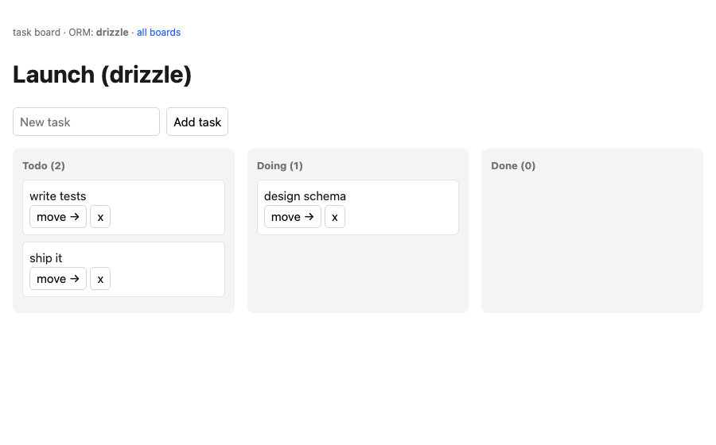

# local-taskboard — a real app on local zeropg Postgres, Drizzle **or** Prisma

A working task-board web app (HTTP server, routed pages, relations, mutations) that runs on a **local in-process Postgres** — no install, no Docker, no daemon. Start it and it writes to a datadir, SQLite-style. The same app runs on **either ORM**, chosen by `DB_ORM`, to prove both work over zeropg; going to a remote Postgres is a one-line `DATABASE_URL` change.



## Run

```sh
pnpm generate            # generate the Prisma client (once)
pnpm start               # Drizzle  (DB_ORM=drizzle, default) -> http://127.0.0.1:PORT
pnpm start:prisma        # Prisma   (DB_ORM=prisma)
pnpm verify              # drives BOTH ORMs end-to-end in a real browser (Playwright)
```

`pnpm verify` output (20 assertions, real Chromium):

```
### drizzle ###   ### prisma ###
  ok create board -> own URL /boards/:id
  ok added two tasks / both in todo
  ok cycle moved a task todo -> doing
  ok delete removed a task
  ok task persisted across reload
  ...
PASS — 20 assertions across drizzle + prisma, driven in a real browser
```

## How it's wired

- **`src/`** — the ORM-agnostic app: `server.ts` (HTTP + routes), `render.ts` (HTML), `types.ts` (the `Store` interface). Routes are real URLs: `GET /`, `GET /boards/:id`, `POST /boards`, `POST /boards/:id/tasks`, `POST /tasks/:id/cycle`, `POST /tasks/:id/delete`.
- **`drizzle/store.ts`** and **`prisma/store.ts`** — the only ORM-specific code, each implementing `Store`. Both start the same way:

  ```ts
  const handle = await resolveDatabaseUrl(process.env.DATABASE_URL ?? 'file:./.pgdata-drizzle')
  // handle.url is a real postgres:// — feed it to node-postgres+Drizzle or @prisma/adapter-pg
  ```

`resolveDatabaseUrl('file:…')` elects (or attaches to) a local single-writer Postgres over the datadir and returns its `postgres://127.0.0.1:<port>` URL — the first process becomes the leader (PGlite + an in-process wire), others attach as clients. `postgres://…` is returned unchanged, so the laptop→remote move is purely the env var.

## ORM notes

- **Drizzle**: fully native. Schema applied here via `create table if not exists`; in a project use `zeropg run drizzle-kit push`.
- **Prisma**: runtime queries go through `@prisma/adapter-pg` over the wire (fully working). Prisma's *native* migrate/`db push` engine can't drive single-session PGlite, so schema is applied via the adapter; the proper migration path is `zeropg migrate dev` / `zeropg migrate deploy`.
