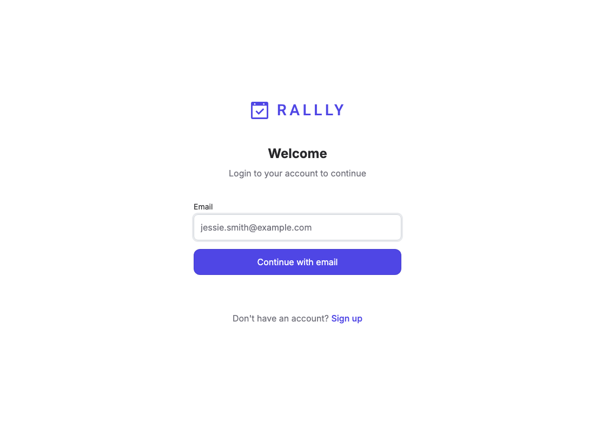

# Rallly on zeropg — swap Postgres for zeropg with no app patch

Proof that a **real, unmodified Prisma app** ([Rallly](https://github.com/lukevella/rallly), a meeting-poll SaaS) can run with its **full Postgres replaced by zeropg** — changing only the Docker setup, never Rallly's source.



## What changed vs. Rallly's own self-hosting compose

Exactly two things — both in `docker-compose.yml`, zero source patches:

1. The `postgres:18-alpine` service → the **`zeropg-db`** service (PGlite on a Docker volume, exposed over the real Postgres wire via `@zeropg/client`'s `serveWire` + pglite-socket, with the `citext` + `pgcrypto` contrib extensions Rallly's schema needs).
2. The app's startup drops `prisma migrate deploy` (Prisma's native schema engine can't drive single-session PGlite) — `zeropg-db` applies Rallly's **real, untouched migrations** in-process on boot. Everything else is Rallly's stock image and stock startup.

Rallly's runtime is unchanged because it already uses `@prisma/adapter-pg` + `DATABASE_URL` (Prisma 7 driver adapter) — exactly the path that works over the wire.

## Run it

```sh
./prepare.sh                 # pack the workspace @zeropg/client into the build context
docker compose up --build    # zeropg-db applies 130 migrations, then Rallly boots against it
# open http://localhost:3000
```

Verify end-to-end in a browser (registers a user through Rallly's UI, then reads it back from zeropg):

```sh
node test/verify.mjs
```

## Verified result

- `zeropg-db` boot: **130/130 of Rallly's real migrations applied, 30 tables** (`citext`/`pgcrypto` loaded).
- Rallly boots (`Next.js 16, Ready`), serves real pages (`/login`, `/register`, `/login/verify`), **no 5xx**.
- Registering through the real UI wrote a full object graph to zeropg via Prisma over the wire:

  ```
  users=1  accounts=1  spaces=1  space_members=1  verifications=1  instance_settings=1
  users row: { id: "...", name: "Zeropg Demo", email: "zeropg-demo@example.com" }
  ```

## Caveats

- Email is not configured (no SMTP), so flows that send a verification code stop at "check your email" — but the DB writes that precede the email (user/account/space/verification rows) land in zeropg, which is what this proves. Add `SMTP_*` env to complete login.
- Single-session PGlite: concurrent requests serialize through one writer (fine for self-host / small instances; the "graduate to a managed Postgres" path is a `DATABASE_URL` change).
- The `zeropg-db` image installs `@zeropg/client` from a packed tarball (`prepare.sh`) so the example works without publishing; once `@zeropg/client` with the `serveWire({ extensions })` option is on npm, the Dockerfile can `npm install @zeropg/client` directly.
